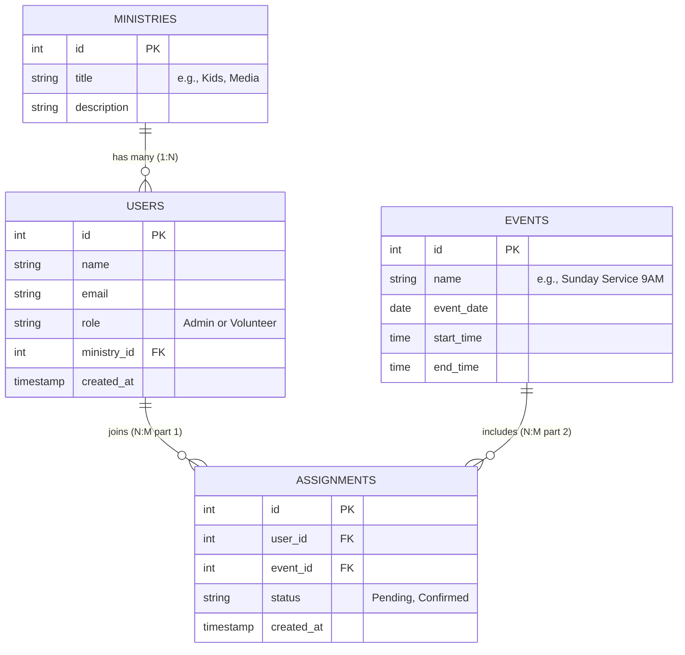

# Entity Relationship Diagram

This diagram outlines the database schema for ServeFlow, showing the 1:N and N:M relationships between our core tables.

### Table Descriptions
- **Users**: Stores all accounts. The `role` column differentiates Admins from Volunteers.
- **Ministries**: Contains the different service areas available.
- **Events**: Stores the specific service times or church events.
- **Assignments**: This is our **Join Table** enabling the many-to-many relationship between Users and Events. It also includes the `status` to track if a volunteer has confirmed their participation.
