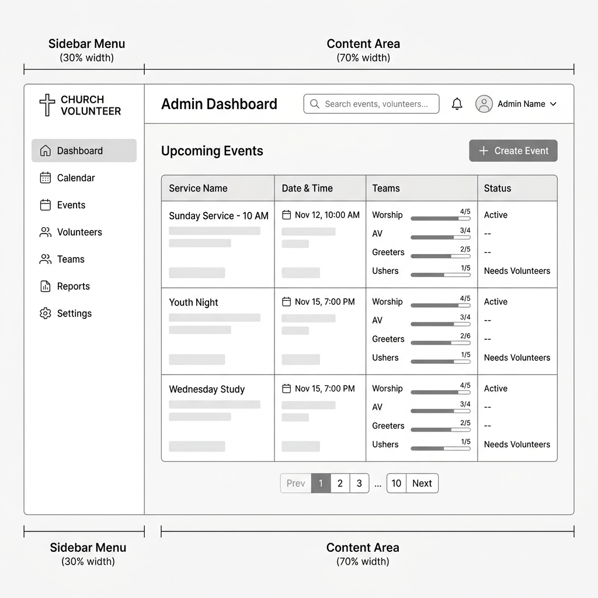
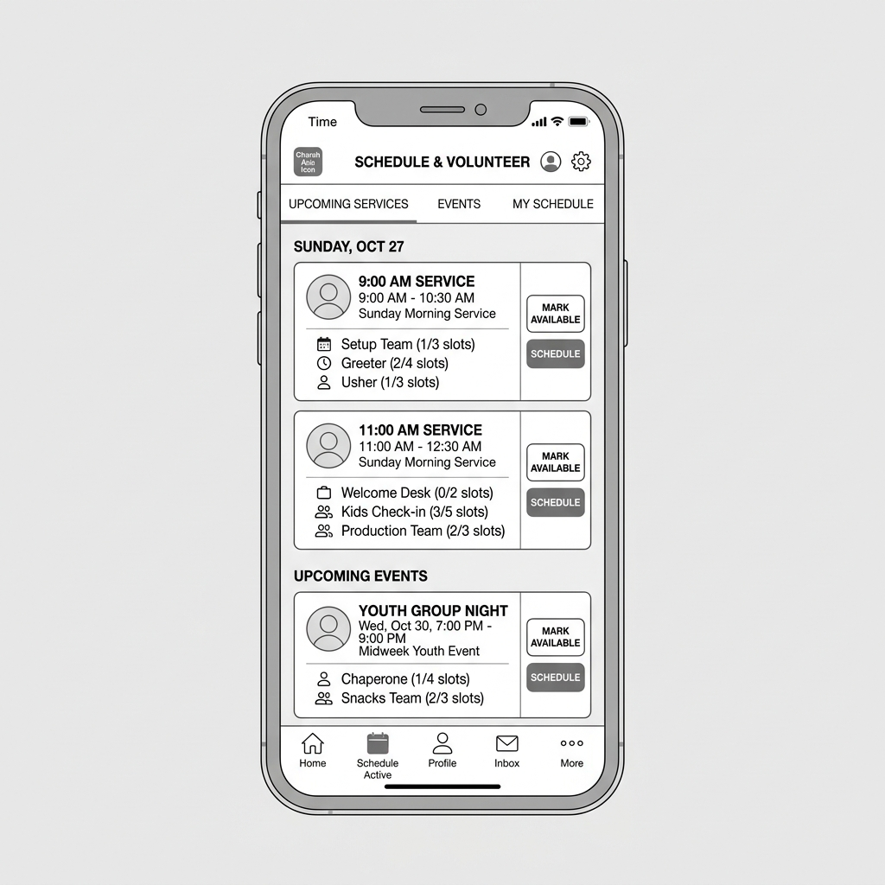
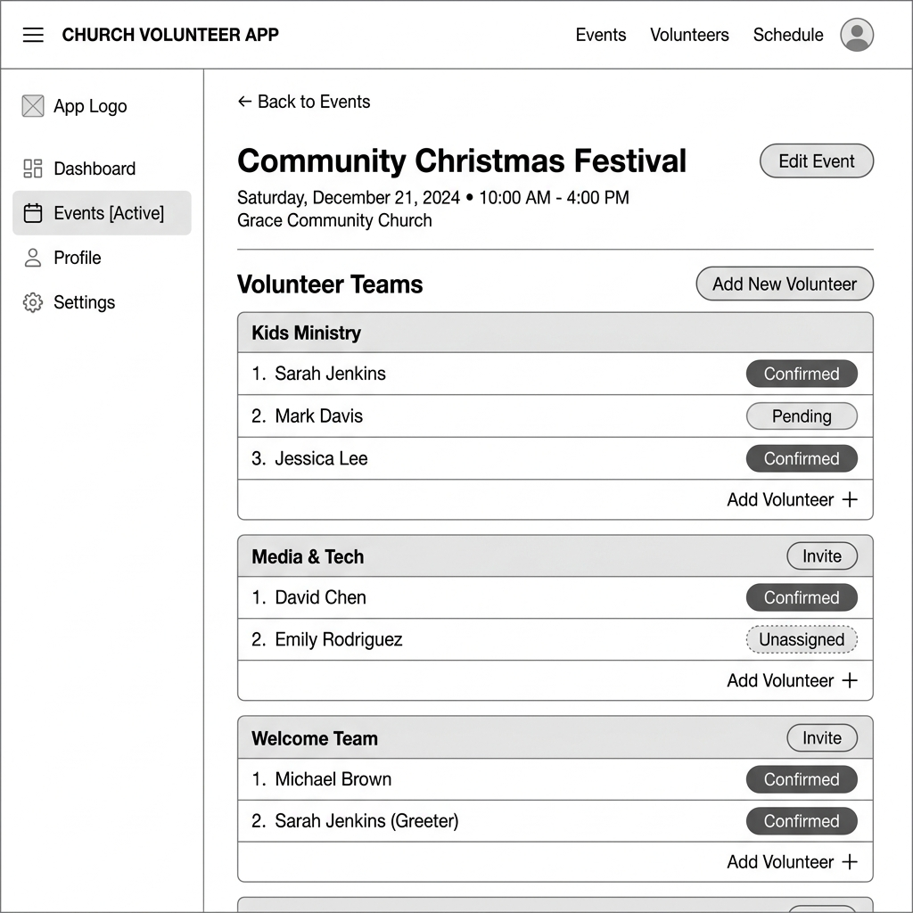

# Wireframes

Here are the wireframes and screen sketches for the ServeFlow application.

### List of Pages
1. **Admin Dashboard (Event Manager)**: Where admins can create new service events and see a high-level view of upcoming dates.
2. **Volunteer Schedule View**: A screen where volunteers can see available events and click to select/request a time slot.
3. **Event Details / Assignment Confirmation**: A specific page for an event showing all ministries and a list of confirmed/pending volunteers for that date.

### Wireframe Images

**1. Admin Dashboard**

**2. Volunteer Schedule View**

**3. Event Details**

